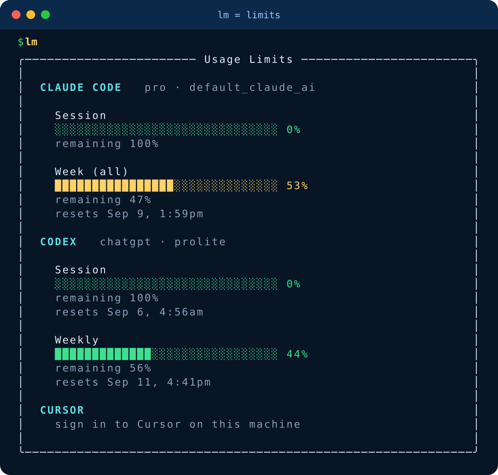
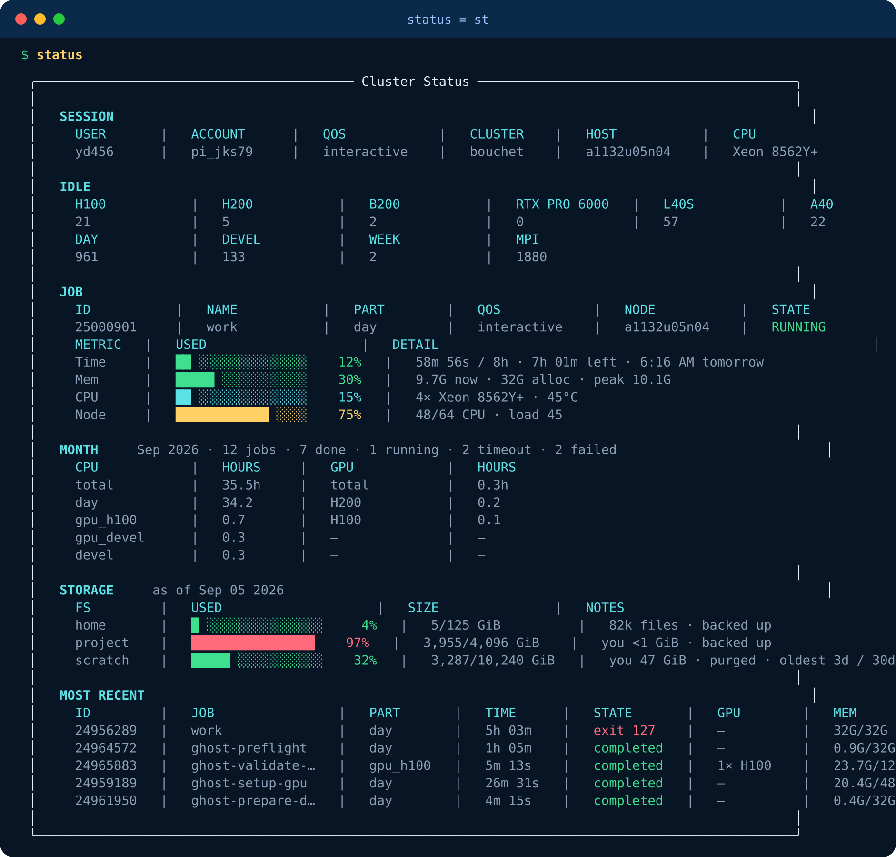
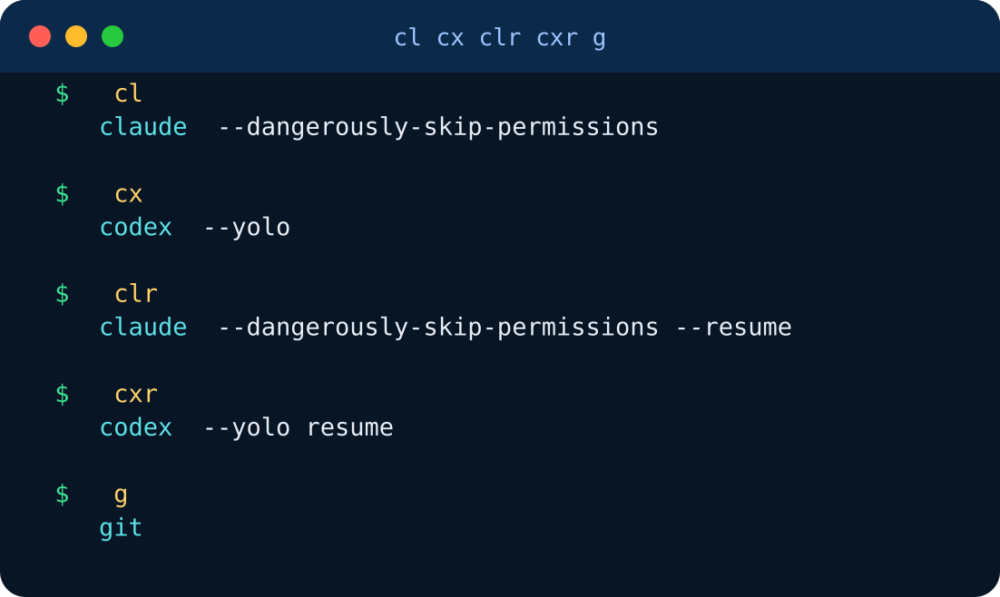

# bouchet-cli

Little commands for Yale's Bouchet cluster.

One paste. Then you type short words and get pretty boxes.

## Install

```bash
curl -fsSL https://raw.githubusercontent.com/ygzdvr/bouchet-cli/main/install.sh | bash
source ~/.bashrc
```

Needs `python3`. Already on the cluster.

## `lm` = usage limits

Same command: `limits`.

Shows Claude, Codex, and Cursor. Cursor has two bars: Cursor's own models, and third-party models.



Green = lots left. Yellow = you're into the week. Cursor needs to be signed in on this computer.

## `status` = what's going on?

Same command: `st`.



Idle GPUs. Your job. This month. Disk. Fresh every time.

## `cl` `cx` `clr` `cxr` `g` = just skip the typing



`cl` opens Claude. No permission nags.  
`cx` opens Codex. Just go.  
`clr` / `cxr` pick up the last chat.  
`g` is git.

## Not happy? Just remove.

```bash
rm -f ~/.local/bin/lm ~/.local/bin/status
```

Then delete the `bouchet-cli aliases` block from `~/.aliases.sh` (or `~/.bashrc`).

MIT · [ygzdvr/bouchet-cli](https://github.com/ygzdvr/bouchet-cli)
